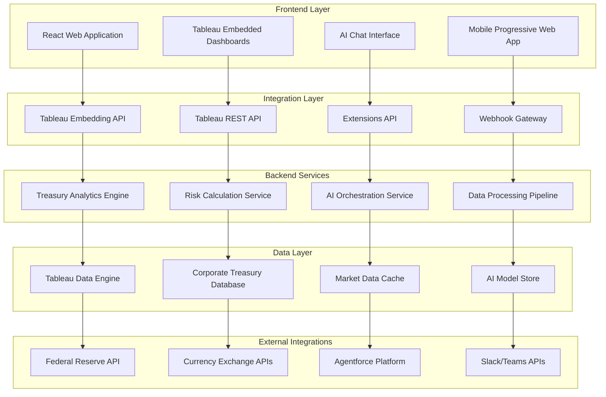

# Design Document: TreasuryIQ - AI-Powered Corporate Treasury Management

## Overview

TreasuryIQ represents a breakthrough in corporate treasury management, combining Tableau's advanced analytics platform with cutting-edge AI to deliver unprecedented insights and automation. Built as a hybrid web application with deep Tableau integration, TreasuryIQ transforms how Fortune 500 companies manage $500M+ treasury operations through conversational AI, predictive analytics, and real-time optimization.

The platform addresses the critical gap in corporate treasury management where traditional tools lack AI-powered insights, resulting in suboptimal decisions that cost companies millions annually. TreasuryIQ delivers measurable ROI through automated cash optimization, proactive risk management, and intelligent workflow integration.

## Architecture

### System Architecture Overview



### Technology Stack

**Frontend Technologies:**
- React 18 with TypeScript for type-safe development
- Next.js 14 for server-side rendering and optimization
- Tableau Embedding API v3 for seamless dashboard integration
- WebSocket connections for real-time updates
- Progressive Web App capabilities for mobile access

**Backend Technologies:**
- Node.js with Express for API gateway and orchestration
- Python with FastAPI for analytics and ML services
- Redis for high-performance caching and session management
- PostgreSQL for transactional data and audit logs
- Docker containers for microservices deployment

**Tableau Integration:**
- Tableau Cloud for dashboard hosting and data engine
- Tableau REST API for programmatic data management
- Tableau Extensions API for custom interactive components
- Tableau Webhooks for real-time event notifications

**AI and Analytics:**
- Salesforce Agentforce for natural language processing
- TensorFlow/PyTorch for custom predictive models
- Apache Kafka for real-time data streaming
- Apache Airflow for data pipeline orchestration

## Components and Interfaces

### Core Components

#### 1. Treasury Analytics Engine
**Purpose:** Central processing unit for all financial calculations and optimizations

**Key Functions:**
- Cash flow analysis and forecasting
- Investment yield optimization algorithms
- Liquidity requirement calculations
- Performance benchmarking and variance analysis

**Interfaces:**
```typescript
interface TreasuryAnalyticsEngine {
  calculateOptimalCashAllocation(positions: CashPosition[]): OptimizationResult;
  forecastCashFlow(historical: HistoricalData, horizon: number): CashFlowForecast;
  assessLiquidityRisk(positions: CashPosition[], requirements: LiquidityRequirement[]): RiskAssessment;
  benchmarkPerformance(actual: Performance, benchmark: Benchmark): PerformanceAnalysis;
}
```

#### 2. Risk Calculation Service
**Purpose:** Real-time financial risk assessment and monitoring

**Key Functions:**
- Value-at-Risk (VaR) calculations across portfolios
- Currency exposure analysis and hedging recommendations
- Credit risk assessment for counterparties and suppliers
- Market risk scenario modeling

**Interfaces:**
```typescript
interface RiskCalculationService {
  calculateVaR(portfolio: Portfolio, confidence: number, horizon: number): VaRResult;
  assessCurrencyRisk(exposures: FXExposure[]): CurrencyRiskAnalysis;
  evaluateCounterpartyRisk(counterparty: Counterparty): CreditRiskScore;
  runStressTest(portfolio: Portfolio, scenarios: StressScenario[]): StressTestResult;
}
```

#### 3. AI Orchestration Service
**Purpose:** Manages conversational AI interactions and intelligent recommendations

**Key Functions:**
- Natural language query processing
- Context-aware response generation
- Recommendation engine for treasury actions
- Learning from user interactions and outcomes

**Interfaces:**
```typescript
interface AIOrchestrationService {
  processNaturalLanguageQuery(query: string, context: UserContext): AIResponse;
  generateRecommendations(data: TreasuryData, preferences: UserPreferences): Recommendation[];
  explainInsight(insight: Insight, detailLevel: DetailLevel): Explanation;
  learnFromFeedback(interaction: Interaction, outcome: Outcome): void;
}
```

#### 4. Data Processing Pipeline
**Purpose:** Handles data ingestion, transformation, and quality assurance

**Key Functions:**
- Real-time market data ingestion and normalization
- Corporate financial data validation and enrichment
- Data quality monitoring and anomaly detection
- Automated data lineage and audit trail generation

**Interfaces:**
```typescript
interface DataProcessingPipeline {
  ingestMarketData(source: DataSource): ProcessingResult;
  validateCorporateData(data: CorporateData): ValidationResult;
  detectAnomalies(dataset: Dataset): AnomalyReport;
  generateAuditTrail(operation: DataOperation): AuditEntry;
}
```

### Integration Interfaces

#### Tableau Integration Layer
```typescript
interface TableauIntegration {
  embedDashboard(dashboardId: string, container: HTMLElement, options: EmbedOptions): Promise<Dashboard>;
  refreshData(datasourceId: string): Promise<RefreshResult>;
  applyFilters(dashboard: Dashboard, filters: Filter[]): Promise<void>;
  exportData(worksheet: Worksheet, format: ExportFormat): Promise<ExportResult>;
}
```

#### External API Interfaces
```typescript
interface ExternalAPIGateway {
  fetchFederalReserveRates(): Promise<InterestRateData>;
  getCurrencyExchangeRates(baseCurrency: string, targetCurrencies: string[]): Promise<ExchangeRateData>;
  sendSlackNotification(channel: string, message: SlackMessage): Promise<NotificationResult>;
  queryAgentforce(prompt: string, context: AgentforceContext): Promise<AgentforceResponse>;
}
```

## Data Models

### Core Data Entities

#### Corporate Treasury Data Model
```typescript
interface CorporateEntity {
  entityId: string;
  entityName: string;
  entityType: 'subsidiary' | 'division' | 'headquarters';
  baseCurrency: Currency;
  reportingCurrency: Currency;
  riskProfile: RiskProfile;
  complianceRequirements: ComplianceRequirement[];
}

interface CashPosition {
  positionId: string;
  entityId: string;
  accountType: 'checking' | 'savings' | 'money_market' | 'cd' | 'treasury';
  currency: Currency;
  balance: number;
  interestRate: number;
  maturityDate?: Date;
  liquidityTier: 'immediate' | 'short_term' | 'medium_term' | 'long_term';
  lastUpdated: Date;
}

interface Investment {
  investmentId: string;
  entityId: string;
  instrumentType: 'treasury_bill' | 'corporate_bond' | 'money_market_fund' | 'cd';
  principalAmount: number;
  currency: Currency;
  interestRate: number;
  maturityDate: Date;
  creditRating: CreditRating;
  marketValue: number;
  unrealizedGainLoss: number;
}

interface FXExposure {
  exposureId: string;
  entityId: string;
  baseCurrency: Currency;
  exposureCurrency: Currency;
  exposureAmount: number;
  hedgeRatio: number;
  hedgeInstruments: HedgeInstrument[];
  riskMetrics: FXRiskMetrics;
}
```

#### Risk and Analytics Data Model
```typescript
interface RiskMetrics {
  entityId: string;
  calculationDate: Date;
  valueAtRisk: {
    oneDay: number;
    tenDay: number;
    confidenceLevel: number;
  };
  currencyRisk: {
    totalExposure: number;
    hedgedPercentage: number;
    unhedgedVaR: number;
  };
  creditRisk: {
    counterpartyExposure: CounterpartyExposure[];
    concentrationRisk: number;
    expectedLoss: number;
  };
  liquidityRisk: {
    liquidityBuffer: number;
    stressTestResult: number;
    fundingGap: number;
  };
}

interface OptimizationRecommendation {
  recommendationId: string;
  entityId: string;
  recommendationType: 'cash_placement' | 'fx_hedge' | 'investment_rebalance' | 'liquidity_management';
  currentState: any;
  recommendedAction: RecommendedAction;
  expectedBenefit: {
    financialImpact: number;
    riskReduction: number;
    confidenceLevel: number;
  };
  implementationSteps: ImplementationStep[];
  urgency: 'low' | 'medium' | 'high' | 'critical';
  validUntil: Date;
}
```

#### AI and User Interaction Data Model
```typescript
interface ConversationContext {
  sessionId: string;
  userId: string;
  entityScope: string[];
  conversationHistory: ConversationTurn[];
  userPreferences: UserPreferences;
  activeFilters: Filter[];
  lastActivity: Date;
}

interface AIInsight {
  insightId: string;
  insightType: 'anomaly' | 'opportunity' | 'risk_alert' | 'performance_variance';
  title: string;
  description: string;
  confidence: number;
  supportingData: any;
  recommendedActions: string[];
  businessImpact: BusinessImpact;
  generatedAt: Date;
}
```

## Correctness Properties

*A property is a characteristic or behavior that should hold true across all valid executions of a system—essentially, a formal statement about what the system should do. Properties serve as the bridge between human-readable specifications and machine-verifiable correctness guarantees.*

Now I'll analyze the acceptance criteria to determine which can be tested as properties, examples, or edge cases.

### Converting EARS to Properties

Based on the prework analysis, I'll convert the testable acceptance criteria into universally quantified properties. After reviewing all properties identified as testable in the prework, I need to eliminate redundancy and ensure each property provides unique validation value.

**Property Reflection:**
- Properties 1.1 and 1.4 both deal with cash optimization but test different aspects (detection vs recommendation generation)
- Properties 2.1, 2.3, and 2.5 all test risk alerting but for different risk types (FX, credit, general)
- Properties 3.1, 3.2, and 3.3 test different aspects of AI interaction (interpretation, explanation, reasoning)
- Properties 5.1 and 10.1 both test performance but for different operations (data refresh vs risk calculations)
- Properties 9.3 and 7.5 both test audit logging but for different contexts (calculations vs actions)

After consolidation, here are the core correctness properties:

**Property 1: Cash Optimization Detection**
*For any* set of cash positions with varying yields, when positions exceed optimal thresholds, the Treasury_System should identify all suboptimal placements and calculate accurate opportunity costs
**Validates: Requirements 1.1**

**Property 2: Market-Driven Recalculation**
*For any* market condition change, the Treasury_System should automatically recalculate optimal cash allocation strategies within the specified timeframe
**Validates: Requirements 1.2**

**Property 3: Liquidity Shortfall Response**
*For any* liquidity forecast indicating shortfalls, the Treasury_System should recommend specific actions with implementation timelines
**Validates: Requirements 1.3**

**Property 4: Comprehensive Optimization Recommendations**
*For any* valid cash position and market condition input, the Optimization_Engine should provide recommendations that include both projected returns and risk assessments
**Validates: Requirements 1.4**

**Property 5: Alert Threshold Enforcement**
*For any* cash optimization opportunity, the Alert_System should notify treasury management if and only if the financial impact exceeds $1M
**Validates: Requirements 1.5**

**Property 6: Risk Threshold Response**
*For any* FX exposure that exceeds predefined thresholds, the Risk_Engine should calculate hedging recommendations with complete cost-benefit analysis
**Validates: Requirements 2.1**

**Property 7: Volatility Impact Assessment**
*For any* market volatility spike above historical norms, the Risk_Engine should assess portfolio impact and suggest appropriate mitigation strategies
**Validates: Requirements 2.2**

**Property 8: Credit Risk Monitoring**
*For any* supplier credit rating deterioration, the Risk_Engine should flag payment risks and recommend protective measures
**Validates: Requirements 2.3**

**Property 9: Continuous VaR Monitoring**
*For any* treasury portfolio composition, the Risk_Engine should continuously monitor and calculate Value-at-Risk across all positions
**Validates: Requirements 2.4**

**Property 10: Critical Risk Alerting**
*For any* risk metric breach of critical levels, the Alert_System should trigger immediate executive notifications
**Validates: Requirements 2.5**

**Property 11: Natural Language Processing**
*For any* financial question asked in natural language, the AI_Agent should interpret intent correctly and provide accurate, relevant responses
**Validates: Requirements 3.1**

**Property 12: Complex Analysis Explanation**
*For any* complex analysis request, the AI_Agent should break down insights into understandable explanations with supporting data
**Validates: Requirements 3.2**

**Property 13: Recommendation Reasoning**
*For any* recommendation provided by the AI_Agent, the response should include both reasoning explanation and confidence levels
**Validates: Requirements 3.3**

**Property 14: Conversational Context Maintenance**
*For any* conversation thread, the AI_Agent should maintain context across multiple interactions for follow-up questions
**Validates: Requirements 3.4**

**Property 15: Technical Term Explanation**
*For any* technical term used in AI interactions, the AI_Agent should provide definitions and relevant business context
**Validates: Requirements 3.5**

**Property 16: Cash Flow Forecasting**
*For any* historical data input, the Treasury_System should generate cash flow forecasts with confidence intervals
**Validates: Requirements 4.1**

**Property 17: Market Impact Prediction**
*For any* market pattern indicating volatility changes, the Risk_Engine should predict impact on treasury positions
**Validates: Requirements 4.2**

**Property 18: Default Probability Calculation**
*For any* supplier financial health deterioration, the Treasury_System should calculate default probabilities
**Validates: Requirements 4.3**

**Property 19: Scenario Analysis Generation**
*For any* set of market conditions, the Treasury_System should provide comprehensive scenario analysis
**Validates: Requirements 4.4**

**Property 20: Automatic Model Retraining**
*For any* forecast accuracy drop below 85%, the Treasury_System should automatically trigger predictive model retraining
**Validates: Requirements 4.5**

**Property 21: Real-time Risk Calculation Performance**
*For any* market data feed update, the Treasury_System should refresh risk calculations within 60 seconds
**Validates: Requirements 5.1**

**Property 22: Data Synchronization**
*For any* internal financial system change, the Integration_Hub should automatically synchronize data
**Validates: Requirements 5.2**

**Property 23: Failover and Alert Mechanism**
*For any* API connection failure, the Treasury_System should alert administrators and switch to backup data sources
**Validates: Requirements 5.3**

**Property 24: Audit Trail Maintenance**
*For any* financial calculation performed, the Treasury_System should maintain complete data lineage and audit trails
**Validates: Requirements 5.4**

**Property 25: Data Quality Flagging**
*For any* detected data quality issue, the Treasury_System should flag all affected analyses and recommendations
**Validates: Requirements 5.5**

**Property 26: Executive Dashboard Display**
*For any* executive user accessing the dashboard, the Dashboard_Interface should display key treasury metrics with trend analysis
**Validates: Requirements 6.1**

**Property 27: Critical Alert Highlighting**
*For any* active critical alert, the Dashboard_Interface should prominently highlight urgent items requiring attention
**Validates: Requirements 6.2**

**Property 28: Drill-down Analysis**
*For any* metric drill-down request, the Dashboard_Interface should provide detailed analysis with supporting data
**Validates: Requirements 6.3**

**Property 29: Automatic Variance Reporting**
*For any* missed performance target, the Dashboard_Interface should automatically generate variance analysis reports
**Validates: Requirements 6.5**

**Property 30: Multi-channel Notification Delivery**
*For any* critical alert generated, the Alert_System should deliver notifications via Slack, email, and mobile push channels
**Validates: Requirements 7.1**

**Property 31: Workflow Routing**
*For any* recommendation requiring approval, the Treasury_System should route requests through appropriate workflow channels
**Validates: Requirements 7.2**

**Property 32: Urgency-based Escalation**
*For any* market opportunity with time constraints, the Alert_System should escalate notifications based on urgency level
**Validates: Requirements 7.3**

**Property 33: Action Logging**
*For any* action taken in the system, the Treasury_System should log decisions and outcomes for performance tracking
**Validates: Requirements 7.5**

**Property 34: Interactive Chart Functionality**
*For any* financial data display, the Dashboard_Interface should provide interactive charts with drill-down capabilities
**Validates: Requirements 8.1**

**Property 35: Time-series Pattern Recognition**
*For any* trend analysis request, the Dashboard_Interface should support time-series analysis with pattern recognition
**Validates: Requirements 8.2**

**Property 36: Scenario Comparison Visualization**
*For any* scenario comparison request, the Dashboard_Interface should provide side-by-side visualization with variance analysis
**Validates: Requirements 8.3**

**Property 37: Compliant Data Export**
*For any* data export operation, the Dashboard_Interface should maintain formatting and include metadata for compliance
**Validates: Requirements 8.5**

**Property 38: Secure Authentication**
*For any* user access attempt, the Treasury_System should authenticate via enterprise SSO with multi-factor authentication
**Validates: Requirements 9.1**

**Property 39: Role-based Data Protection**
*For any* sensitive data display, the Treasury_System should apply role-based access controls and data masking
**Validates: Requirements 9.2**

**Property 40: Calculation Audit Logging**
*For any* financial calculation performed, the Treasury_System should maintain detailed audit logs with user attribution
**Validates: Requirements 9.3**

**Property 41: Data Encryption**
*For any* data handled by the system, the Treasury_System should encrypt all data in transit and at rest using enterprise-grade encryption
**Validates: Requirements 9.4**

**Property 42: Compliance Report Generation**
*For any* compliance report request, the Treasury_System should generate standardized reports with digital signatures
**Validates: Requirements 9.5**

**Property 43: Large Dataset Processing Performance**
*For any* large dataset processing operation, the Treasury_System should complete risk calculations within 30 seconds
**Validates: Requirements 10.1**

**Property 44: Concurrent User Performance**
*For any* concurrent user access scenario, the Dashboard_Interface should maintain sub-2-second response times
**Validates: Requirements 10.2**

**Property 45: Auto-scaling Capability**
*For any* data volume increase, the Treasury_System should scale processing capacity automatically
**Validates: Requirements 10.3**

**Property 46: High Availability**
*For any* operational period, the Treasury_System should support 99.9% uptime with automated failover capabilities
**Validates: Requirements 10.4**

**Property 47: Load Prioritization**
*For any* system load peak, the Treasury_System should prioritize critical risk calculations and executive dashboards
**Validates: Requirements 10.5**

## Error Handling

### Error Classification and Response Strategy

**Data Quality Errors:**
- **Detection**: Automated data validation pipelines with statistical anomaly detection
- **Response**: Quarantine affected data, alert data stewards, provide alternative data sources
- **Recovery**: Implement data correction workflows with audit trails

**System Integration Errors:**
- **Detection**: Health checks and heartbeat monitoring for all external APIs
- **Response**: Automatic failover to backup data sources, administrator notifications
- **Recovery**: Circuit breaker patterns with exponential backoff retry logic

**Performance Degradation:**
- **Detection**: Real-time performance monitoring with configurable thresholds
- **Response**: Load balancing, resource scaling, non-critical feature degradation
- **Recovery**: Auto-scaling policies and performance optimization algorithms

**Security Incidents:**
- **Detection**: Intrusion detection systems and anomalous access pattern monitoring
- **Response**: Immediate session termination, security team alerts, audit log generation
- **Recovery**: Incident response procedures with forensic analysis capabilities

**AI Model Errors:**
- **Detection**: Confidence score monitoring and prediction accuracy tracking
- **Response**: Fallback to rule-based systems, model retraining triggers
- **Recovery**: A/B testing for model updates and gradual rollout procedures

## Testing Strategy

### Dual Testing Approach

The testing strategy employs both unit testing and property-based testing as complementary approaches to ensure comprehensive coverage and correctness validation.

**Unit Testing Focus:**
- Specific business scenarios and edge cases
- Integration points between system components
- Error handling and recovery mechanisms
- User interface interactions and workflows
- API endpoint functionality and data validation

**Property-Based Testing Focus:**
- Universal properties that hold across all valid inputs
- Financial calculation accuracy across diverse datasets
- System behavior under varying load conditions
- Data consistency and integrity across operations
- Security and compliance requirements validation

### Property-Based Testing Configuration

**Testing Framework:** Hypothesis (Python) for backend services, fast-check (TypeScript) for frontend components

**Test Configuration:**
- Minimum 100 iterations per property test to ensure comprehensive input coverage
- Each property test references its corresponding design document property
- Tag format: **Feature: treasuryiq-corporate-ai, Property {number}: {property_text}**

**Example Property Test Structure:**
```python
@given(cash_positions=st.lists(cash_position_strategy(), min_size=1, max_size=20))
def test_cash_optimization_detection(cash_positions):
    """
    Feature: treasuryiq-corporate-ai, Property 1: Cash Optimization Detection
    For any set of cash positions with varying yields, when positions exceed 
    optimal thresholds, the Treasury_System should identify all suboptimal 
    placements and calculate accurate opportunity costs
    """
    result = treasury_system.identify_suboptimal_placements(cash_positions)
    
    # Verify all suboptimal positions are identified
    assert all(pos.yield_rate < optimal_threshold for pos in result.suboptimal_positions)
    
    # Verify opportunity costs are calculated
    assert all(pos.opportunity_cost > 0 for pos in result.suboptimal_positions)
    
    # Verify calculations are mathematically correct
    for pos in result.suboptimal_positions:
        expected_cost = (optimal_yield - pos.yield_rate) * pos.amount
        assert abs(pos.opportunity_cost - expected_cost) < 0.01
```

### Integration Testing Strategy

**Tableau Integration Testing:**
- Embedded dashboard functionality across different browsers and devices
- API integration with Tableau Cloud for data refresh and user management
- Extension functionality within Tableau environment
- Webhook event handling and real-time updates

**External API Integration Testing:**
- Federal Reserve API data ingestion and processing
- Currency exchange rate API reliability and failover
- Agentforce natural language processing accuracy
- Slack and email notification delivery

### Performance Testing Requirements

**Load Testing Scenarios:**
- 100 concurrent users accessing dashboards simultaneously
- Large dataset processing (10M+ treasury transactions)
- Real-time data ingestion from multiple sources
- AI query processing under high volume

**Performance Benchmarks:**
- Dashboard load time: < 2 seconds for 95th percentile
- Risk calculation completion: < 30 seconds for large portfolios
- API response time: < 500ms for 99th percentile
- Data synchronization: < 60 seconds for market data updates

### Security Testing Framework

**Authentication and Authorization Testing:**
- SSO integration with various identity providers
- Multi-factor authentication workflows
- Role-based access control enforcement
- Session management and timeout handling

**Data Protection Testing:**
- Encryption verification for data in transit and at rest
- Data masking effectiveness for different user roles
- Audit trail completeness and integrity
- Compliance report generation accuracy

This comprehensive testing strategy ensures that TreasuryIQ meets the highest standards of reliability, performance, and security required for enterprise treasury management operations.

## Enhanced Dynamic Dashboard Design

### Overview

The Enhanced Dynamic Dashboard represents a sophisticated, interactive visualization layer that transforms static treasury data into compelling, actionable insights. Built with advanced charting libraries and real-time data streaming, the dashboard provides executives and treasury professionals with an immersive experience that makes complex financial data immediately understandable and actionable.

### Design Principles

**1. Progressive Disclosure**
- Start with high-level KPIs and allow drill-down to detailed analysis
- Use layered information architecture to prevent cognitive overload
- Implement contextual help and explanations for complex metrics

**2. Real-time Responsiveness**
- All data updates should be reflected within 60 seconds
- Use smooth animations and transitions to indicate data changes
- Provide visual indicators for data freshness and connectivity status

**3. Intelligent Interactivity**
- Charts should respond to user interactions with meaningful feedback
- Cross-chart filtering and highlighting to show data relationships
- Contextual tooltips with actionable insights and recommendations

**4. Accessibility and Performance**
- Ensure all visualizations are accessible via keyboard navigation
- Optimize for performance with large datasets using virtualization
- Maintain responsive design across all device types

### Component Architecture

#### 1. Enhanced Loading Experience

**Sophisticated Loading Animations:**
```typescript
interface LoadingExperience {
  brandedSpinner: {
    animation: 'gradient-pulse' | 'rotating-logo' | 'bouncing-dots';
    duration: number;
    colors: BrandColors;
  };
  progressIndicators: {
    dataLoading: ProgressBar;
    chartRendering: ProgressBar;
    aiProcessing: ProgressBar;
  };
  loadingMessages: {
    sequential: string[];
    contextual: boolean;
    estimatedTime: number;
  };
}
```

**Implementation Features:**
- Multi-stage loading with specific messages for each phase
- Estimated completion times based on historical performance
- Branded visual elements that reinforce TreasuryIQ identity
- Smooth transitions from loading to content display

#### 2. Animated Metric Cards

**Dynamic Number Counting:**
```typescript
interface AnimatedMetricCard {
  value: {
    current: number;
    previous: number;
    target: number;
  };
  animation: {
    countingDuration: number;
    easing: 'ease-in-out' | 'bounce' | 'elastic';
    triggerOnVisible: boolean;
  };
  trendIndicator: {
    direction: 'up' | 'down' | 'stable';
    percentage: number;
    timeframe: string;
    color: TrendColor;
  };
  sparkline: {
    data: number[];
    showTrend: boolean;
    height: number;
  };
}
```

**Visual Features:**
- Numbers animate from 0 to current value on first load
- Trend arrows with color-coded indicators (green/red/gray)
- Mini sparkline charts showing recent trend history
- Hover effects revealing additional context and details

#### 3. Multi-Dimensional Cash Flow Analysis

**Composed Chart Visualization:**
```typescript
interface CashFlowAnalysis {
  chartTypes: {
    primary: 'composed'; // Bars + Lines
    secondary: 'area' | 'waterfall' | 'sankey';
  };
  dataLayers: {
    inflow: BarChartLayer;
    outflow: BarChartLayer;
    netFlow: LineChartLayer;
    forecast: LineChartLayer;
    confidence: AreaChartLayer;
  };
  interactivity: {
    brushSelection: boolean;
    crossFiltering: boolean;
    drillDown: DrillDownConfig;
  };
  scenarios: {
    base: ScenarioData;
    optimistic: ScenarioData;
    pessimistic: ScenarioData;
    stress: ScenarioData;
  };
}
```

**Advanced Features:**
- Predictive modeling with confidence intervals displayed as shaded areas
- Scenario comparison with toggle switches for different projections
- Brush selection for time-range filtering across all dashboard charts
- Waterfall charts showing cash flow components and their contributions

#### 4. Advanced Risk Visualization

**Radar Chart for Multi-Dimensional Risk:**
```typescript
interface RiskRadarChart {
  dimensions: {
    var95: RiskDimension;
    var99: RiskDimension;
    creditRisk: RiskDimension;
    marketRisk: RiskDimension;
    fxRisk: RiskDimension;
    liquidityRisk: RiskDimension;
  };
  visualization: {
    scales: 'linear' | 'logarithmic';
    gridLines: number;
    fillOpacity: number;
    strokeWidth: number;
  };
  comparison: {
    current: RiskProfile;
    benchmark: RiskProfile;
    target: RiskProfile;
    historical: RiskProfile[];
  };
}
```

**Correlation Scatter Plot:**
```typescript
interface CorrelationAnalysis {
  assetClasses: AssetClass[];
  correlationMatrix: number[][];
  visualization: {
    bubbleSize: 'volume' | 'volatility' | 'var';
    colorScale: 'diverging' | 'sequential';
    animation: 'fade-in' | 'bubble-up';
  };
  interactivity: {
    hoverDetails: boolean;
    clickThrough: boolean;
    brushSelection: boolean;
  };
}
```

#### 5. Portfolio Performance Visualization

**Interactive Treemap for Asset Allocation:**
```typescript
interface AssetAllocationTreemap {
  hierarchy: {
    level1: 'assetClass';
    level2: 'currency' | 'maturity' | 'rating';
    level3: 'individual';
  };
  sizing: 'marketValue' | 'notionalAmount' | 'riskContribution';
  coloring: 'performance' | 'risk' | 'yield' | 'duration';
  animation: {
    onLoad: 'fade-in' | 'grow-in';
    onHover: 'highlight' | 'zoom';
    onResize: 'smooth-transition';
  };
  drillDown: {
    enabled: boolean;
    levels: number;
    breadcrumbs: boolean;
  };
}
```

**Bubble Chart for Risk-Return Analysis:**
```typescript
interface RiskReturnBubbleChart {
  axes: {
    x: 'risk' | 'volatility' | 'var';
    y: 'return' | 'yield' | 'alpha';
  };
  bubbleSize: 'marketValue' | 'allocation' | 'liquidity';
  quadrants: {
    highRiskHighReturn: QuadrantConfig;
    highRiskLowReturn: QuadrantConfig;
    lowRiskHighReturn: QuadrantConfig;
    lowRiskLowReturn: QuadrantConfig;
  };
  benchmarks: {
    riskFreeRate: number;
    marketReturn: number;
    targetReturn: number;
  };
}
```

#### 6. Real-Time Data Streaming Indicators

**Live Data Visualization:**
```typescript
interface RealTimeIndicators {
  connectionStatus: {
    indicator: 'pulse' | 'heartbeat' | 'wave';
    colors: {
      connected: string;
      connecting: string;
      disconnected: string;
    };
    position: 'header' | 'footer' | 'floating';
  };
  dataFreshness: {
    timestamps: Map<string, Date>;
    stalenessThreshold: number;
    warningIndicators: boolean;
  };
  streamingEffects: {
    newDataHighlight: boolean;
    valueChangeAnimation: boolean;
    chartUpdateTransition: boolean;
  };
}
```

#### 7. AI-Powered Insights Integration

**Intelligent Insight Cards:**
```typescript
interface AIInsightCard {
  insight: {
    type: 'opportunity' | 'risk' | 'anomaly' | 'recommendation';
    title: string;
    description: string;
    confidence: number;
    impact: FinancialImpact;
  };
  visualization: {
    iconAnimation: 'pulse' | 'glow' | 'bounce';
    confidenceBar: boolean;
    impactVisualization: 'gauge' | 'bar' | 'trend';
  };
  interactivity: {
    expandable: boolean;
    actionable: boolean;
    dismissible: boolean;
  };
  aiExplanation: {
    reasoning: string;
    dataPoints: DataPoint[];
    methodology: string;
  };
}
```

### Chart Library Integration

**Recharts Configuration:**
```typescript
interface RechartsConfig {
  theme: {
    colors: BrandColorPalette;
    fonts: TypographyScale;
    spacing: SpacingScale;
  };
  responsiveConfig: {
    breakpoints: Breakpoint[];
    chartSizing: ResponsiveSizing;
    fontScaling: boolean;
  };
  performance: {
    virtualization: boolean;
    lazyLoading: boolean;
    dataThrottling: number;
  };
  accessibility: {
    ariaLabels: boolean;
    keyboardNavigation: boolean;
    screenReaderSupport: boolean;
  };
}
```

**Custom Chart Components:**
- **TreasuryComposedChart**: Combines bars, lines, and areas for cash flow analysis
- **RiskRadarChart**: Multi-dimensional risk visualization with comparison overlays
- **PerformanceWaterfallChart**: Shows performance attribution and variance analysis
- **CorrelationHeatmap**: Interactive correlation matrix with drill-down capabilities
- **ScenarioComparisonChart**: Side-by-side scenario analysis with variance highlighting

### Performance Optimization

**Data Management:**
```typescript
interface DataOptimization {
  caching: {
    strategy: 'memory' | 'localStorage' | 'indexedDB';
    ttl: number;
    invalidation: 'time-based' | 'event-based';
  };
  virtualization: {
    enabled: boolean;
    windowSize: number;
    overscan: number;
  };
  lazyLoading: {
    charts: boolean;
    data: boolean;
    images: boolean;
  };
  dataThrottling: {
    updateFrequency: number;
    batchSize: number;
    prioritization: 'user-visible' | 'background';
  };
}
```

**Rendering Optimization:**
- Use React.memo for expensive chart components
- Implement shouldComponentUpdate for data-heavy visualizations
- Utilize Web Workers for complex calculations
- Implement progressive loading for large datasets

### Error Handling and Fallbacks

**Graceful Degradation:**
```typescript
interface ErrorHandling {
  chartErrors: {
    noData: FallbackComponent;
    loadingError: FallbackComponent;
    renderError: FallbackComponent;
  };
  dataErrors: {
    staleData: WarningIndicator;
    partialData: PartialDataIndicator;
    invalidData: ErrorMessage;
  };
  networkErrors: {
    offline: OfflineIndicator;
    slowConnection: SlowConnectionWarning;
    apiError: APIErrorMessage;
  };
}
```

**User Experience During Errors:**
- Clear error messages with suggested actions
- Fallback to cached data when available
- Progressive enhancement for optional features
- Retry mechanisms with exponential backoff

### Mobile and Responsive Design

**Adaptive Chart Layouts:**
```typescript
interface ResponsiveCharts {
  breakpoints: {
    mobile: ChartConfig;
    tablet: ChartConfig;
    desktop: ChartConfig;
    ultrawide: ChartConfig;
  };
  touchOptimization: {
    gestureSupport: boolean;
    touchTargetSize: number;
    swipeNavigation: boolean;
  };
  dataSimplification: {
    mobileDataReduction: boolean;
    aggregationLevel: 'high' | 'medium' | 'low';
    chartTypeSubstitution: boolean;
  };
}
```

This enhanced dashboard design creates a compelling, professional treasury management interface that transforms complex financial data into actionable insights through sophisticated visualizations and intelligent user experience design.